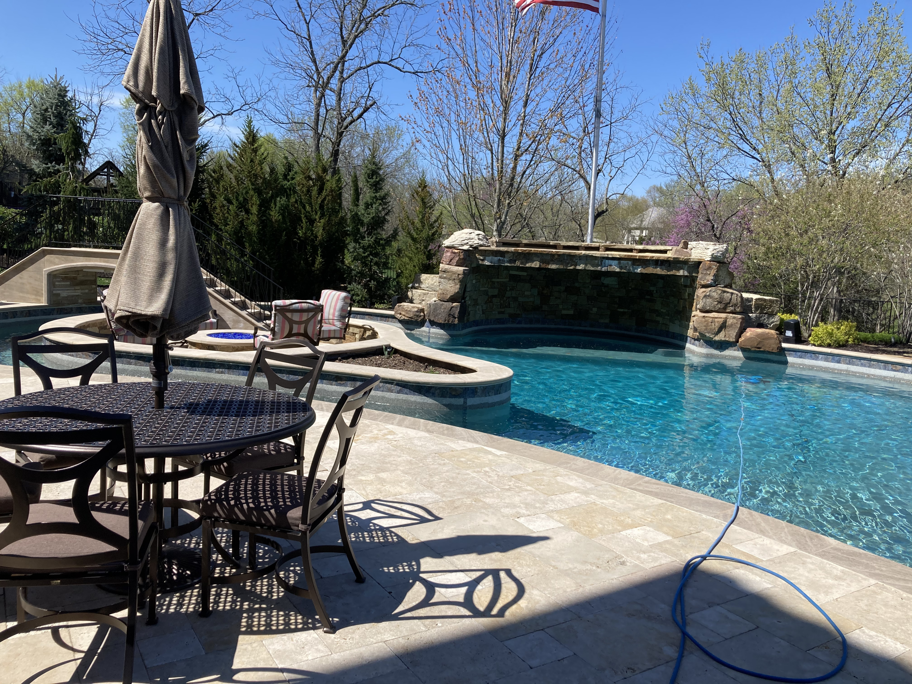

# Image Optimization Guide for Designer Pools

## 🚨 Current Problem
Your pool images are **3-5MB each**, which means:
- Slow page loading (especially on mobile)
- Poor Google PageSpeed scores
- Higher bounce rates
- Wasted bandwidth/hosting costs
- Poor user experience

## 🎯 Goal
Reduce each image to **under 300KB** while maintaining visual quality.

---

## Option 1: Online Tools (Easiest)

### TinyPNG (Recommended for beginners)
1. Go to https://tinypng.com
2. Drag all 9 images from the `images/` folder
3. Wait for compression (usually 60-80% reduction)
4. Download the compressed images
5. Replace original images in your `images/` folder

**Pros:** 
- No software needed
- Excellent quality
- Free for up to 20 images

**Expected results:** 4MB → ~600KB per image

---

### Squoosh (Best quality control)
1. Go to https://squoosh.app
2. Open each image one at a time
3. Settings to use:
   - Format: **MozJPEG** or **WebP**
   - Quality: **80-85%**
   - Resize: Width **1920px** (keep aspect ratio)
4. Compare before/after with the slider
5. Download and replace

**Pros:**
- See real-time comparison
- Fine-tune quality vs size
- Can convert to WebP

**Expected results:** 4MB → ~200KB per image

---

## Option 2: Batch Processing (For tech-savvy users)

### Using ImageMagick (Command line)

**Install:**
```bash
# Windows (using Chocolatey)
choco install imagemagick

# Mac (using Homebrew)
brew install imagemagick

# Linux
sudo apt install imagemagick
```

**Optimize all images at once:**
```bash
# Navigate to your images folder
cd c:\Users\db0010\git\webdesignerpools\images

# Backup originals first!
mkdir originals
copy *.jpg originals\

# Resize and compress all images
magick mogrify -resize 1920x1920> -quality 85 -strip *.jpg
```

**What this does:**
- `-resize 1920x1920>` = Resize to max 1920px width (only if larger)
- `-quality 85` = 85% JPEG quality (good balance)
- `-strip` = Remove metadata (reduces file size)
- `*.jpg` = Process all JPG files

**Expected results:** 4MB → ~200KB per image

---

## Option 3: Convert to WebP (Advanced)

WebP images are 25-35% smaller than JPEG with same quality.

### Using Squoosh:
1. Open image at https://squoosh.app
2. Change format to **WebP**
3. Set quality to **85**
4. Resize to **1920px** width
5. Download as `.webp`

### Using ImageMagick:
```bash
cd c:\Users\db0010\git\webdesignerpools\images

# Convert all JPG to WebP
for %%f in (*.jpg) do (
  magick convert "%%f" -resize 1920x1920> -quality 85 "%%~nf.webp"
)
```

### Update HTML to use WebP with JPEG fallback:
```html
<picture>
  <source srcset="images/IMG_0702.webp" type="image/webp">
  
</picture>
```

---

## Quick Comparison

| Method | Ease of Use | Quality | Speed | Cost |
|--------|-------------|---------|-------|------|
| TinyPNG | ⭐⭐⭐⭐⭐ | ⭐⭐⭐⭐ | ⭐⭐⭐⭐ | Free* |
| Squoosh | ⭐⭐⭐⭐ | ⭐⭐⭐⭐⭐ | ⭐⭐⭐ | Free |
| ImageMagick | ⭐⭐ | ⭐⭐⭐⭐ | ⭐⭐⭐⭐⭐ | Free |
| WebP Conversion | ⭐⭐⭐ | ⭐⭐⭐⭐⭐ | ⭐⭐⭐⭐ | Free |

*TinyPNG free tier: 20 images/month

---

## Recommended Settings

### For Slideshow Images (full-screen display):
- **Maximum width:** 1920px
- **Format:** JPEG or WebP
- **Quality:** 85%
- **Target size:** 200-300KB

### For Thumbnails (if you add them later):
- **Maximum width:** 400px
- **Format:** JPEG or WebP
- **Quality:** 80%
- **Target size:** 30-50KB

---

## Testing Results

After optimization, test your website:

1. **Google PageSpeed Insights**
   - Go to: https://pagespeed.web.dev
   - Enter: https://designerpoolskc.com
   - Target score: 90+ (mobile), 95+ (desktop)

2. **GTmetrix**
   - Go to: https://gtmetrix.com
   - Enter your URL
   - Check "Fully Loaded Time" and "Total Page Size"

### Expected improvements:
- **Before:** Page size ~35MB, Load time 15-30 seconds
- **After:** Page size ~2MB, Load time 2-4 seconds
- **Speed increase:** 7-10x faster ⚡

---

## Step-by-Step: TinyPNG Method (Recommended)

1. **Backup originals**
   ```
   Copy the images folder to images_backup
   ```

2. **Go to TinyPNG**
   - Visit https://tinypng.com

3. **Upload images**
   - Drag all 9 JPG files at once
   - Wait for processing (1-2 minutes)

4. **Download**
   - Click "Download all" button
   - Extract the ZIP file

5. **Replace files**
   - Copy optimized images back to your `images/` folder
   - Replace the old large files

6. **Test locally**
   - Open index.html in browser
   - Check if images still look good
   - Check slideshow works properly

7. **Deploy**
   - Commit changes to Git
   - Push to GitHub/Netlify
   - Test live site

---

## Quality Check

After optimization, images should:
- ✅ Load quickly (under 2 seconds on 4G)
- ✅ Look sharp and professional
- ✅ No visible compression artifacts
- ✅ Work on mobile and desktop

If images look blurry:
- Increase quality to 90%
- Make sure width is at least 1920px
- Use Squoosh for better quality control

---

## Need Help?

If you're unsure about optimizing images yourself:
1. Use TinyPNG - it's foolproof
2. Download the "Download All" ZIP
3. Replace your images folder
4. Done!

**Can't go wrong with TinyPNG.** It automatically picks the best settings.

---

*Last Updated: March 14, 2026*
